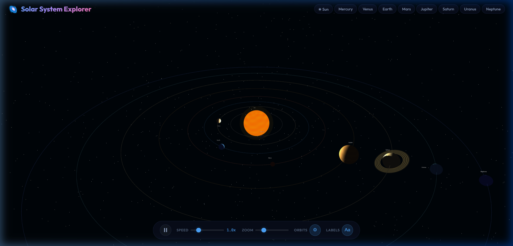
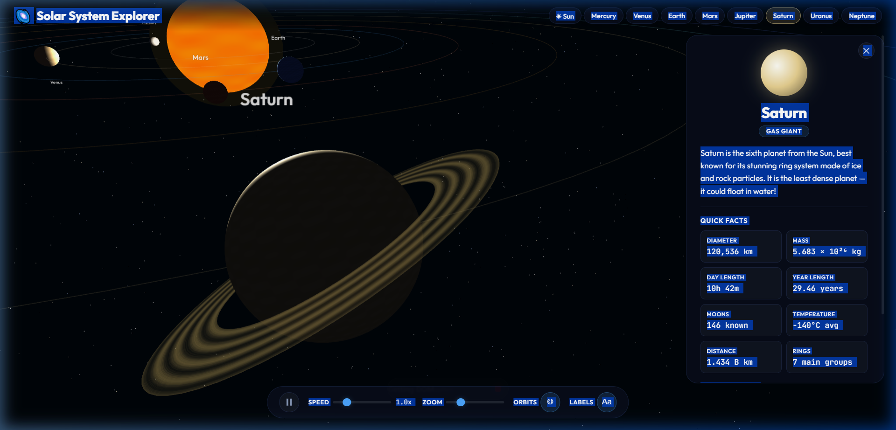
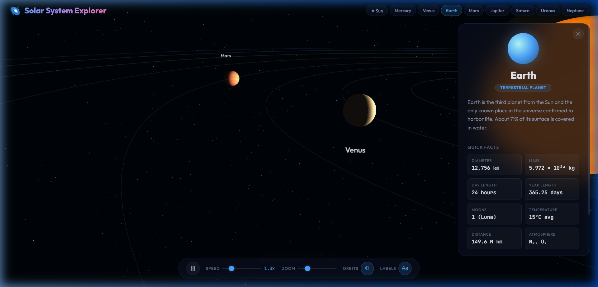

# 🌌 Solar System Explorer

An interactive 3D solar system built with **Three.js** — explore all 8 planets with orbital animations, camera fly-to navigation, and detailed planet info.

> Built with **HTML**, **CSS**, and **JavaScript** + **Three.js** (via CDN). No build tools, no npm install.



---

## ✨ Features

- 🌞 **Glowing Sun** — emissive central star with pulsating glow effect
- 🪐 **All 8 Planets** — Mercury through Neptune, each with unique procedural textures and correct orbital spacing
- 💍 **Saturn's Rings** — rendered with transparency and procedural banding
- ⭐ **5,000-Star Background** — immersive starfield with color-temperature variations
- 🎯 **Click to Explore** — click any planet (or use the nav bar) to fly the camera there
- 📋 **Info Panel** — glassmorphism panel with Quick Facts, description, and "Did You Know?" trivia
- ⏯️ **Speed & Pause** — control orbit speed from 0x to 5x, or pause entirely
- 🔭 **Zoom Control** — smooth zoom slider + scroll wheel
- 🏷️ **Labels & Orbits** — toggle planet labels and orbit paths on/off
- 🖱️ **Mouse Controls** — drag to rotate, scroll to zoom (OrbitControls)
- ⌨️ **Keyboard Shortcuts** — `Space` to pause, `Escape` to close panel

---

## 📸 Screenshots

### Saturn Close-Up
Fly to Saturn and see its iconic ring system with the info panel showing all its data:



### Earth Info Panel
Detailed planet facts including diameter, mass, atmosphere, moons, and a fun fact:



---


---

## 📁 Project Structure

```
├── index.html       # Main page + Three.js CDN
├── index.css        # Space dark theme, glassmorphism UI
├── planets.js       # Sun + 8 planets data (facts, orbital params)
├── app.js           # Three.js scene, rendering, interactions
└── screenshots/     # Screenshots for README
```

---

## 🛠️ Technologies

| Tech | Usage |
|------|-------|
| **Three.js** | 3D rendering, lighting, camera controls |
| **HTML5 Canvas** | WebGL rendering surface |
| **CSS3** | Glassmorphism UI, custom properties, transitions |
| **JavaScript** | Procedural textures, raycasting, animation loop |
| **Google Fonts** | Outfit & JetBrains Mono |

---

## 🎮 Controls

| Input | Action |
|-------|--------|
| 🖱️ **Drag** | Rotate view |
| 🔄 **Scroll** | Zoom in/out |
| 🎯 **Click Planet** | Fly camera to planet + show info |
| `Space` | Pause/resume |
| `Escape` | Close info panel |

---

## 📄 License

MIT License — feel free to use, modify, and share!

---

<p align="center">
  Made with ❤️ and 🚀
</p>
